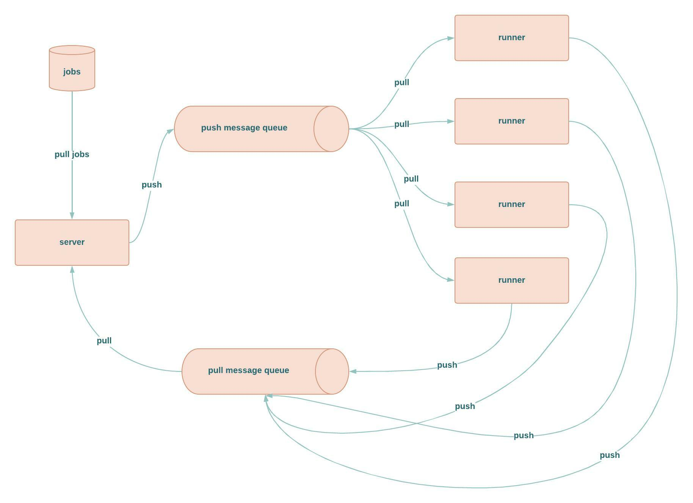
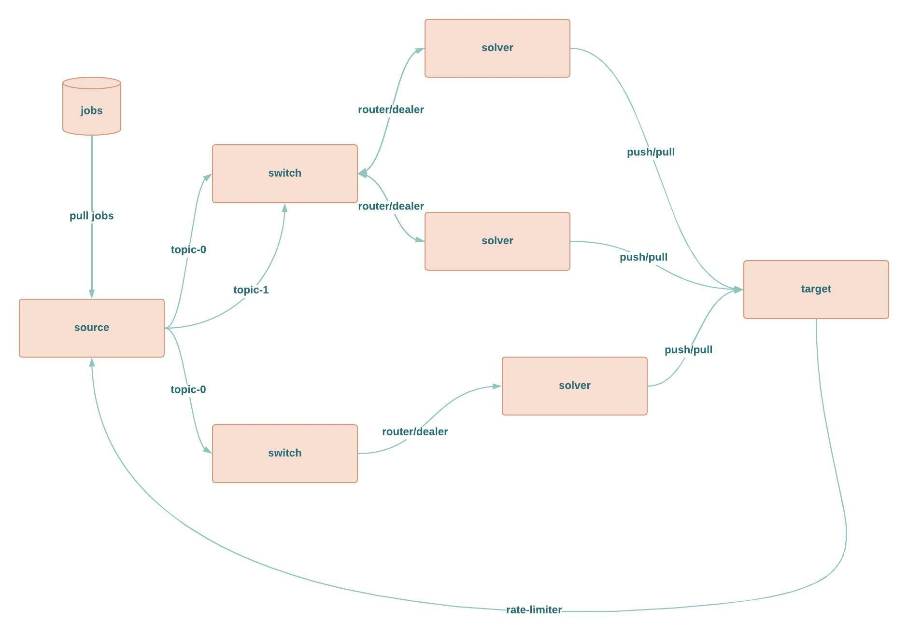

# mqsolver
mqsolver is a library based on (zeromq, multiprocessing, threading), it allows to build distributed strategies for IO and CPU tasks.

<p align="center"> 
  
  <h3 align="center">
    high level view of mqsolver architecture
  </h3>  
</p>


<p align="center"> 
  
  <h3 align="center">
    zoom in runner architecture
  </h3>  
</p>

# mypy validation 
```bash
mypy . --check-untyped-defs --explicit-package-bases
```

